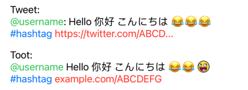

# ActiveLabel.swfit-Demo

This is a example project for using modified ver [ActiveLabel](https://github.com/TwidereProject/ActiveLabel.swift) with [twitter-text](https://github.com/twitter/twitter-text) And [Kanna](https://github.com/tid-kijyun/Kanna).




## Install

Setup the project via CocoaPods

```
pod install
```

## Note 
This example app demo how to parse the tweet and toot. If your backend gives the attirbutes about entity in the text. You can combine it then assign the entities to ActiveLabel manually. 